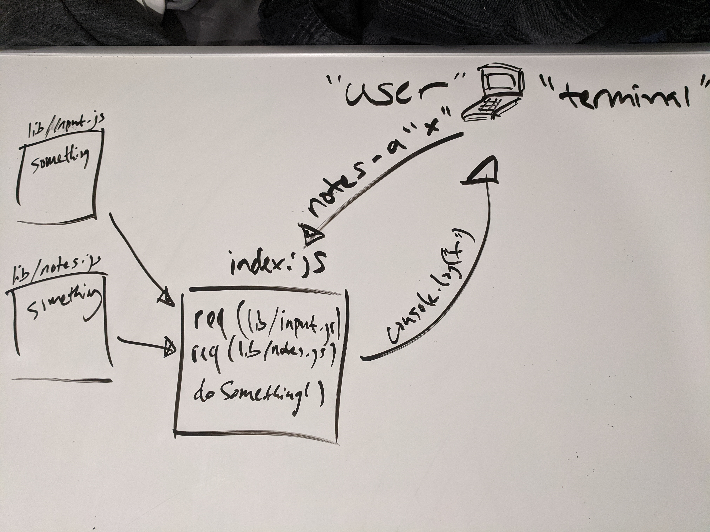

# LAB - Class xx

## Project Name

### Author: Student/Group Name

### Links and Resources

- [submission PR](https://github.com/claytonjones-401n16/lab-01/pull/2)
- [ci/cd](https://github.com/claytonjones-401n16/lab-01/actions) (GitHub Actions)

### Setup

#### `.env` requirements (where applicable)

N/A

#### How to initialize/run your application (where applicable)

- If cloned repo: `npm i` then `node index.js -a "NOTE_TO_ADD"`
- For npm package: `npm i NPM_PACKAGE_NAME`

#### How to use your library (where applicable)
- `notes -a (or --add) "NOTE_TO_ADD"`

#### Tests

- How do you run tests?
  - `npm test`
- Any tests of note?
  - 7 tests of input module
    - testing various flags and making data is within those flags
  - 2 tests of notes module
    - testing that the prototype functions call and produce as expected
- Describe any tests that you did not complete, skipped, etc
  - all tests complete, 100% line coverage

#### UML

